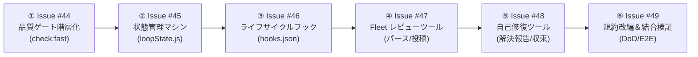

# ADR-0016: ループエンジニアリング確立に向けた開発ハーネスの 6 段階リファクタリング＆責務分割

- **ステータス**: Accepted
- **決定日**: 2026-09-07
- **関連Issue**: Issue #44, Issue #45, Issue #46, Issue #47, Issue #48, Issue #49

---

## 1. コンテキスト (Context)

ADR-0013 において、GitHub Actions（ADR-0012）のクォータ制限（RPD制限）や手元自己修復不能を克服するため、IDE 内の最上位モデルを活用する「Antigravity Fleet レビュー」へ移行しました。
しかし、実際の運用において以下の構造的課題が顕在化しました：

1. **プロンプト依存による早期停止と再現性の欠如**:
   - Fleet レビューの起動が `AGENTS.md` の自然言語の指示に 100% 依存していたため、エージェントが PR 作成の時点で「作業完了」と自己判断して会話を止めてしまう（早期停止）。
2. **ループエンジニアリング（自己修復ループ）の本質的未完結**:
   - Fleet レビューは「レビューを投稿して終わり」ではなく、指摘事項（`[must]`, `[should]`）を手元で自己修復し、`[LGTM (All Resolved)]` に至るまでループを回し切るために導入された。しかし、エージェントが途中でユーザーにボールを投げてしまう。
3. **機械的ライフサイクルフックと状態管理の不在**:
   - Git フック（`pre-commit`, `pre-push`）はコミットとプッシュしか監視できず、エージェントの推論や PR 作成後のフェーズには介入できない。
   - また、エージェントの会話履歴（Context）以外に「現在ループのどの位置にいるか」を判定する状態ファイル（State）が存在しないため、`Stop` フック単体では判定が不可能。
4. **品質ゲートの二重実行による待ち時間ボトルネック**:
   - `npm run check`（フル品質ゲート: 15秒）が手動実行と `pre-push` フックで重複実行され、さらに自己修復ループ中の軽微な 1 行修正でも毎回カバレッジや本番ビルドが走り、ループ速度を著しく低下させている。
5. **一括対応による見落としリスク**:
   - これら全てを単一の Issue/PR で対応しようとすると、設計の穴や見落としが必ず発生する。

---

## 2. 決定事項 (Decisions)

単一責任の原則（SRP）に基づき、開発ハーネスを **6 つの独立した段階（Issue #44〜#49）** に分割してリファクタリングする。

### 段階的ロードマップと各 Issue の責務定義

| Step | Issue | タイトル | 主な責務・スコープ | 依存関係 |
| :---: | :---: | :--- | :--- | :--- |
| **1** | **#44** | **品質ゲートの階層化と手動フルチェック二重実行の排除** | `package.json` に `check:fast`（型検査＋テストのみ：2〜3秒）を新設。プッシュ時の `pre-push` フック（フルゲート）に委ね、エージェントの手動二重実行を撤廃して以降の開発速度を向上。 | なし |
| **2** | **#45** | **ループ状態管理マシン（State Machine）の設計・単体実装** | `.agents/state/loop_state.json` のスキーマ定義と、読み書き・遷移・停止可否判定（`canStop()`）を行う純粋スクリプト `scripts/harness/loopState.js` の実装。Vitest で 100% 単体テスト。 | #44 |
| **3** | **#46** | **ライフサイクルフック（hooks.json）による機械的インターセプトの配備** | `.agents/hooks.json` を配備。`PostToolUse`（`gh pr create` 検知で状態記録）と `Stop`（`RESOLVED_LGTM` 未達時の停止拒否）、`PreToolUse`（勝手なマージ等の禁止）を実装。 | #45 |
| **4** | **#47** | **Fleet レビュー実行・安全コメント投稿・結果パースツールの実装** | Windows PowerShell の引数エスケープ事故を防ぐ一時ファイル経由の PR 投稿ラッパーの実装。また Conventional Comments に称賛ラベル `[good]` を新設して `[nits]` との意味の二重化を解消し、レビュー結果の自動パース・状態更新ツールを実装。単体テスト作成。 | #45, #46 |
| **5** | **#48** | **指摘自己修復・PRコメント解決報告ツールの実装** | 修正コミット紐付け解決コメント自動投稿スクリプトの実装。全指摘解消を確認し、状態を `RESOLVED_LGTM` へ遷移させる収束ロジックの実装。単体テスト作成。 | #47 |
| **6** | **#49** | **AGENTS.md / SKILL.md 規約改編・二重管理解消と自己修復ループ E2E 検証** | `AGENTS.md` に「DoD（LGTM まで作業終了禁止）」を明文化。`SKILL.md` のコピペ重複を廃止し上記ツール群の Runbook に整理。チェッカー更新と E2E 結合検証。 | #44〜#48 |

---

## 3. 結果・影響 (Consequences)

### ポジティブ
- エージェントが PR 作成後に勝手に作業を終了できなくなり、プログラム（フック）によって物理的に自己修復ループへ引き戻される。
- 各 Issue の変更量が極小（差分 100 行前後）となり、見落としやテスト漏れが構造的に根絶される。
- ループ中の反復検証が 15 秒から 2〜3 秒へと約 5 倍高速化される。
- 本 ADR により、全体のロードマップと進捗トレーサビリティが恒久的に担保される。

### 留意点
- 1 つひとつの Issue を順序正しく完了させてから次の Issue へ進む必要がある（飛び越し着手は禁止）。
